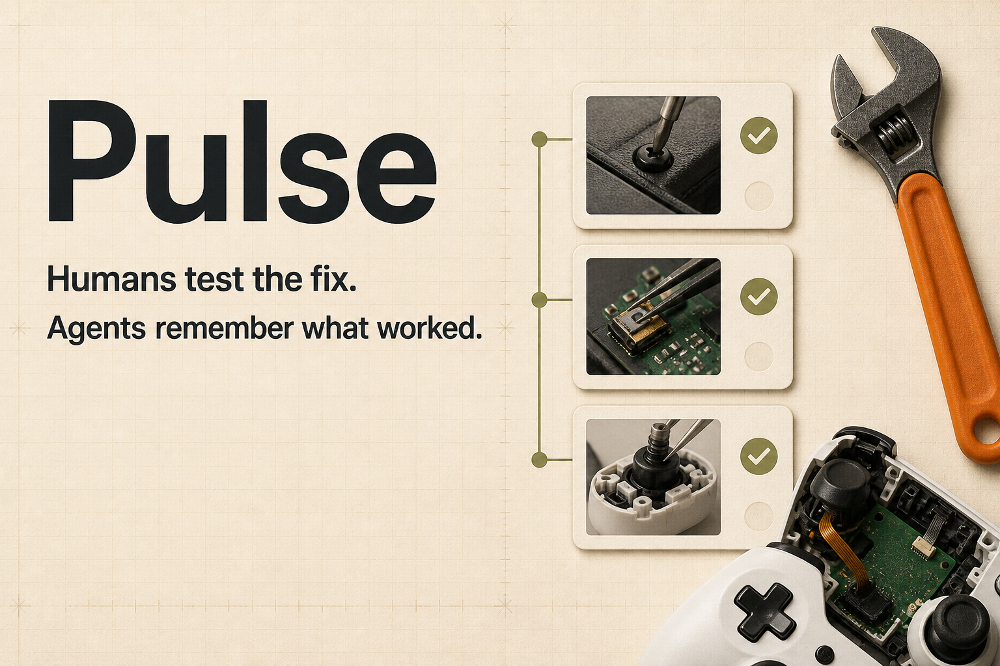

# Pulse

> The open repair memory for humans and agents.

Pulse is a public repair evidence network where people test fixes in the physical world and AI agents preserve what actually worked through WebMCP.

- Live application: https://pulse.alx21.chatgpt.site
- Source repository: https://github.com/agammann/pulse



## Why WebMCP

Most websites force an agent to reverse-engineer a visual interface. Pulse exposes the real application capabilities instead. A compatible browser can discover ten imperative tools through `document.modelContext.registerTool(...)`, validate typed inputs, and receive compact structured results without scraping the DOM.

The WebMCP layer is not a second demo API: every tool calls the same persisted application routes used by the human interface. Mutations create visible repair history and write to the activity log.

## Human + agent workflow

1. A human describes a broken object.
2. The agent searches structured repair evidence and compares fixed, improved, and failed outcomes.
3. The agent creates a case and proposes a safe diagnostic step.
4. The human performs the physical test and reports the observation.
5. The agent records the result and, when appropriate, the repair attempt and outcome.
6. Pulse makes that evidence available to the next human-agent pair.

The AI does information work. The human interacts with the physical object. Pulse remembers the result.

## Product surfaces

- `/` — landing page and evidence-led product story
- `/repairs` — weighted repair search and filters
- `/repairs/[id]` — complete diagnostic timeline, attempts, outcome, safety, and votes
- `/repair/new` — human-facing case creation
- `/dashboard` — community statistics and recent repairs
- `/webmcp` — live tool registry, permission model, and judge prompts
- `/about` — open repair mission and human-agent model

The app ships with 30 clearly labeled synthetic repair cases across game controllers, keyboards, computer peripherals, small electronics, bicycles, home-office equipment, and cables. They include overlapping symptoms, different outcomes, costs, times, and community evidence so search results are meaningful on first load.

## Architecture

```text
Human UI (React / Next.js routes)       WebMCP agent tools
                 \                      /
                  \                    /
                  Next route handlers
                           |
              validation + rate limiting
                           |
                   Cloudflare D1 (SQL)
                           |
          cases, steps, attempts, outcomes,
             votes, products, agent activity
```

- **UI:** Next.js-compatible React application built by Vinext, TypeScript, Tailwind CSS
- **Runtime:** OpenAI Sites on a Cloudflare Worker
- **Persistence:** Cloudflare D1 with relational schema and packaged migrations
- **Search:** deterministic weighted ranking over exact model, brand, category, symptoms, outcome, and community evidence
- **Agent interface:** current imperative WebMCP API with a feature-detected `navigator.modelContext` fallback
- **Dependencies:** no OpenAI API key and no client-side AI simulation

## WebMCP tools

| Tool | Mode | Capability |
| --- | --- | --- |
| `search_repairs` | Read | Search by text, category, brand, model, symptom, outcome, difficulty, and limit |
| `get_repair_case` | Read | Retrieve one complete structured repair history |
| `create_repair_case` | Mutate | Create a public repair case and return its ID |
| `add_diagnostic_step` | Mutate | Add a proposed non-destructive diagnostic test |
| `add_diagnostic_result` | Mutate | Record the human's observed result and notes |
| `record_repair_attempt` | Mutate | Record a fix attempt, parts, cost, and difficulty |
| `record_repair_outcome` | Mutate | Record final outcome, fix, cost, time, and notes |
| `mark_case_helpful` | Mutate | Add helpful, worked-for-me, or did-not-work evidence |
| `list_common_failures` | Read | Aggregate common failures and successful solutions |
| `get_repair_statistics` | Read | Retrieve public totals, categories, and recent successes |

Each definition contains explicit JSON Schema, required fields, bounded input lengths, read-only annotations where appropriate, and `untrustedContentHint` for community content. Outputs are deliberately compact for agent use.

## Local installation

Requirements: Node.js 22.13+ and pnpm.

```bash
git clone https://github.com/agammann/pulse.git
cd pulse
pnpm install
pnpm dev
```

Open `http://localhost:3000`. No environment variables or user account are required. In a standard browser, the full human interface continues to work and the activity dock reports that WebMCP was not detected.

## Database and seed data

The D1 binding is named `DB` in `.openai/hosting.json`. The canonical Drizzle schema is in `db/schema.ts`; deployable SQL is in `drizzle/0000_mendsignal.sql`.

On the first database-backed request, `ensureDatabase()` applies idempotent table/index creation and seeds the 30 demo cases if the database is empty. Seed source lives in `lib/seed-data.ts`. Every demo record is marked `demo_record: true` in API output and the interface.

No `.env` values are required. `.env.example` documents the zero-secret setup.

## Development commands

```bash
pnpm dev          # local app
pnpm test         # seven workflow tests
pnpm lint         # static linting
pnpm build        # production worker build
```

The automated suite covers search, retrieval, case creation, diagnostic-step creation, diagnostic-result recording, outcome recording, and validation failures. See [WEBMCP_TESTING.md](WEBMCP_TESTING.md) for browser and judge testing.

## Security and repair safety

Community repair text is untrusted data, never trusted tool metadata or agent instruction. Inputs are constrained in both WebMCP JSON Schema and server handlers. Mutation routes validate values, apply basic per-IP rate limiting, and return safe errors. There is no delete tool.

Every repair is classified as low risk, moderate risk, or professional recommended. Professional-risk histories remain readable, but Pulse refuses procedural diagnostic-step creation and directs the user to qualified service. See [SECURITY.md](SECURITY.md) for the complete trust model and reporting process.

## Open repair data

Pulse's concepts are inspired by the Open Repair Data Standard: product identity, problem, repair status, barriers, and outcome are explicit data rather than prose fragments. Pulse is an independent project and does not claim affiliation with the Open Repair Alliance.

## Judge demo

Open the deployed site in ChatGPT's in-app browser and ask:

1. “Search Pulse for controller stick drift.”
2. “Show me the most successful fixes.”
3. “Create a repair case for a controller with left-stick drift.”
4. “Add a diagnostic step to inspect the joystick for contamination.”
5. “Record that cleaning did not fix the issue.”
6. “Record the final repair as fixed.”
7. “Show me Pulse's repair statistics.”

Watch the visible Agent Activity panel and repair timeline update as tools run.

## Deployment

The production output is built with `pnpm build` and packaged with its D1 migration for OpenAI Sites. The public deployment does not require authentication. Deployment provenance is a saved immutable site version tied to the repository commit.

## Hackathon

Built for the OpenAI WebMCP Challenge. Pulse uses the challenge's current imperative WebMCP API and is designed to demonstrate real human-agent collaboration over durable shared state.

## License

MIT © 2026 Pulse contributors. See [LICENSE](LICENSE).
